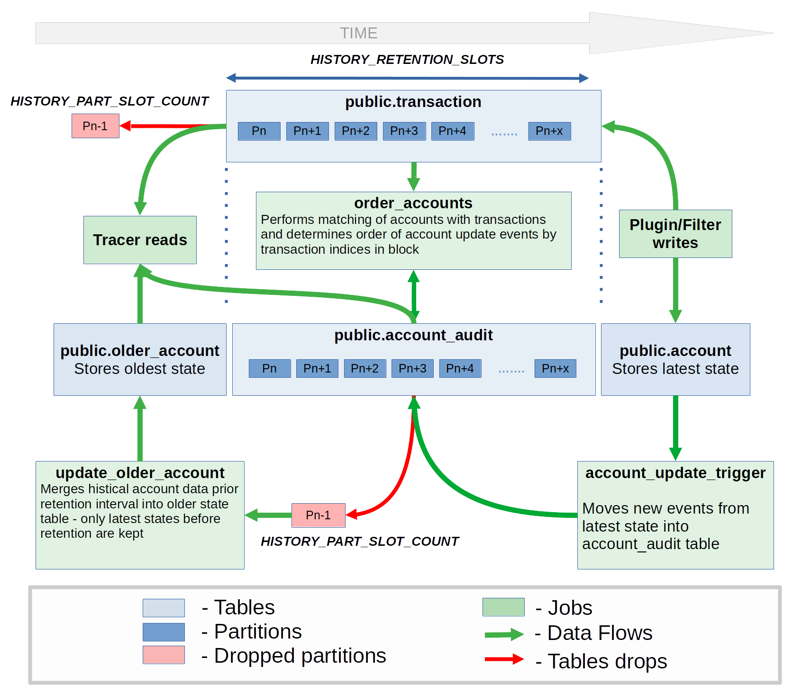

# Postgres DB for Tracer API

## Contents

- DB schema - create_schema.sql, create_functions.sql, partitions.sql.template, drop_schema.sql
- Deployment scipt - deploy.sh
- CI dockerfile - Dockerfile

## History flow
Picture below represents data flow between different parts of Tracer DB. The most of tables in DB are partitioned and have retention period for its data in the sake of disk space economy. *account* table is temporary table for storing account update events. *order_accounts* job shots once a second and performs matching of account update events with transactions by transaction signature to order accounts according to order of transactions in block. This is done for compatibility with several validators producing update events into single database. *write_version* field of original account update event is based on atomic counter inside validator and are not suitable to syncronize data from different validators. Transaction indices instead are the same for all validators and can be used to restore order of account update events.



## Deployment

1. Install pg_partman and pg_cron extensions (please, refer to original docs https://github.com/pgpartman/pg_partman https://github.com/citusdata/pg_cron)
2. Start database engine
3. run deployment script on the same machine with DB and with next env variables:
   - PGDATA - path to postgres configuration files (e. g. /var/lib/postgresql/data)
   - POSTGRES_USER - name of the deployer-user
   - PGPASSWORD - password of deployer-user
   - HISTORY_PART_SLOT_COUNT - number of solana slots which will be stored in a single partition of history. **Recommended value - 216000 (about one day of history)**
   - HISTORY_START_SLOT - number of first slot **Recommended value - number of current slot on a moment of starting validator with clean DB**
   - HISTORY_RETENTION_SLOTS - number of slots to store in history. Account's data from older slots will be merged into older_account table and corresponding partitions will be deleted every maintenance period, partitions with outdated transaction will be dropped. **Recommended value - 6480000 (about one month of history)**
   - TEMP_ACCOUNT_PART_SLOT_COUNT - number of solana slots which will be stored in a single partition of account table. Account table is temporary storage for update account events before they being ordered using indexes of corresponding transactions. **Recommended value - 4500 (30 minutes of history)**
   - TEMP_ACCOUNT_RETENTION_SLOTS - number of slots to store in account table. Partitions with event for outdated slots will be removed by schedule. Retention period should be long enough for DB to move all data from temporary account table into account_audit table **Recommended value - 54000 (6 hours of history)**
   - MAINTENANCE_SCHEDULE - schedule of maintenance procedure. Determines how often will table creation|retention performed. This variable should store string in cron-compatible format (e. g. */5 * * * * - to run maintenance every 5 minutes). Make sure maintenance interval will be lower than time required to produce single account_audit partition (considering single slot takes ~0.4 seconds). **Recommended value - */30 * * * * (run maintenance every half an hour)**

   Example of the command:
   
   ```bash
   PGDATA=/var/lib/postgresql/data POSTGRES_USER=solana-user PGPASSWORD=solana-pass HISTORY_PART_SLOT_COUNT=216000 HISTORY_START_SLOT=0 HISTORY_RETENTION_SLOTS=6480000 TEMP_ACCOUNT_PART_SLOT_COUNT=4500 TEMP_ACCOUNT_RETENTION_SLOTS=54000 MAINTENANCE_SCHEDULE="*/30 * * * *" ./deploy.sh
   ```
   This command will create DB schema with account_audit table splitted by days, retention interval of 30 days and maintenance happened every day at 00:30 AM 

